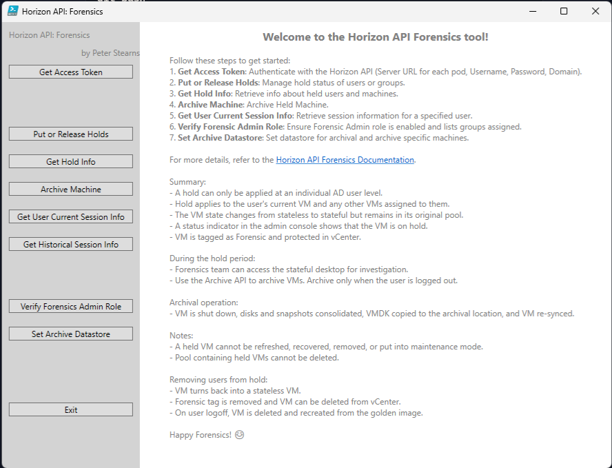

# Horizon API: Forensics


## Table of Contents
- [Overview](#overview)
- [Features](#features)
- [Usage Instructions](#usage-instructions)
  - [Getting Started](#getting-started)
  - [Key Notes](#key-notes)
- [Detailed Archival Process](#detailed-archival-process)
  - [Removing Users from Hold](#removing-users-from-hold)
- [Additional Resources](#additional-resources)
- [Licensing](#licensing)
- [Disclaimer](#disclaimer)

---

## Overview

The **Horizon API: Forensics** tool, is designed to streamline forensic investigations within the Horizon environment. This tool offers robust functionality for managing virtual machines (VMs) and performing key forensic tasks with precision.

---

## Features

### Authentication
- **Get Access Token**: Authenticate seamlessly using server details, credentials, and domain.

### Hold Management
- **Put or Release Holds**: Apply or remove hold statuses for users or groups.
- **Get Hold Info**: Retrieve detailed information about held users and machines.

### Archival Operations
- **Archive Machine**: Securely archive held machines for further analysis.
- **Set Archive Datastore**: Configure and manage the datastore for VM archival.

### User Session Insights
- **Get Current Session Info**: Access session information for specified users.
- **Get Historical Session Info**: Review historical session data for investigative purposes.

### Forensic Administration
- **Verify Forensic Admin Role**: Ensure that the forensic admin role is enabled and list the associated groups.

### Exit Function
- **Exit**: Close the tool gracefully.

---

## Tool Interface

Below is a screenshot of the Horizon Forensic API Tool in action:



---

## Usage Instructions

### Getting Started
Follow these steps to utilize the Horizon API: Forensics tool effectively:
1. **Authenticate**: Use the `Get Access Token` feature to authenticate with the Horizon API.
2. **Manage Holds**:
   - Apply or release holds on users or groups using the `Put or Release Holds` feature.
   - Retrieve hold details with `Get Hold Info`.
3. **Archival Operations**:
   - Use the `Archive Machine` feature to archive held VMs during user logoff.
   - Configure archival settings with `Set Archive Datastore`.
4. **Session Information**:
   - Fetch user session data using `Get Current Session Info` or `Get Historical Session Info`.
5. **Verify Forensic Role**: Confirm and review the forensic admin role configuration.
6. **Exit Safely**: Use the `Exit` function when you’re finished.

### Key Notes:
- Holds apply exclusively to individual Active Directory users.
- Held VMs remain in a **stateful** mode, tagged as *Forensic* and protected in vCenter.
- Forensic teams can access held VMs during the investigation period.
- Archive operations consolidate snapshots and relocate VMDK files securely.
- Held VMs and their pools cannot be deleted during the hold period.

---

## Example: Running the Horizon Forensic API Script

To use the Horizon Forensic API tool, simply open PowerShell and execute the script using the following command:

```powershell
./HorizonForensicAPI_v4.ps1
```
---

## Detailed Archival Process

1. VM is shut down, with disks and snapshots consolidated.
2. VMDK files are copied to the archival location.
3. VM is re-synchronized for further use.

### Removing Users from Hold
- Converts the VM back to a **stateless** mode.
- Forensic tags are removed, enabling deletion from vCenter.
- Upon user logoff, VMs are refreshed and recreated from the golden image.

---

## Additional Resources

For comprehensive documentation, visit the [Horizon API Forensics Documentation](https://docs.omnissa.com/bundle/Desktops-and-Applications-in-HorizonVmulti/page/ForensicsSelectHoldforWindowsInstantCloneDesktops.html).

---

## Licensing

This project is licensed under the MIT License. Refer to the [LICENSE](./LICENSE) file for details.

---

## Disclaimer

The use of this tool requires appropriate administrative privileges. Ensure compliance with organizational policies before proceeding with forensic investigations.

